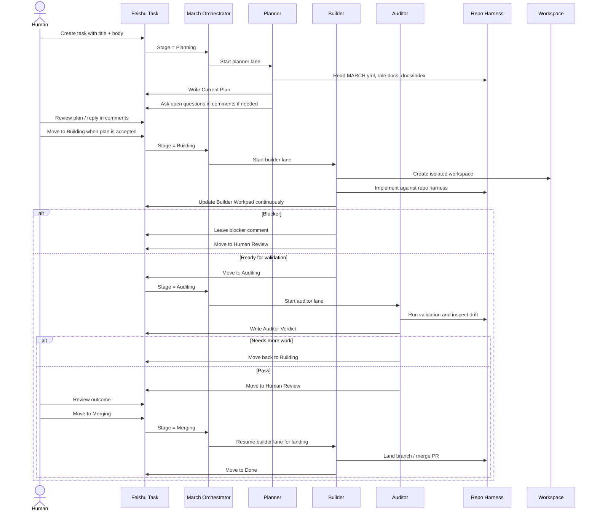

# March

Multi-lane coding orchestration for Feishu task workflows.

March is a Feishu-native orchestration system for planner, builder, and auditor agent workflows.
It is built for real repositories, long-running tasks, isolated workspaces, and
human-in-the-loop delivery through Feishu task comments, stages, and canonical
artifacts.

## What March Is

- A multi-lane coding workflow with planner, builder, and auditor roles
- A Feishu-native task system built around stages, comments, and custom fields
- A repo-as-harness execution model driven by repo docs, role docs, and isolated workspaces
- A human-in-the-loop delivery loop that keeps plan, execution, and review on the same task surface

## Why March

March is built around three opinions:

- orchestration should be long-running and lane-based, not a single chat loop
- the repo should own truth, while the runtime owns lifecycle
- Feishu comments, sections, and custom fields are a better collaboration surface for many China-based teams than a separate tracker stack

In practice that means:

- Planner reads the repo harness and writes one canonical implementation plan.
- Builder works in an isolated workspace and maintains one canonical builder workpad.
- Auditor validates the change, checks test coverage and harness drift, and decides whether more work is required.
- Humans stay on the same task surface through comments and stage changes.

## How It Works



March keeps the workflow surface in Feishu, while repo-local files remain the source of truth:

- `MARCH.yml`
- `PLANNER.md`
- `BUILDER.md`
- `AUDITOR.md`
- `docs/index.md`

## Quickstart

1. Clone this repo.
2. Install `mise`, Elixir, and the other toolchain dependencies used by the `elixir/` app.
3. Run:

```bash
./scripts/setup
```

4. Install and authenticate `lark-cli`.
5. Bootstrap a Feishu tasklist:

```bash
./scripts/feishu-bootstrap --check-only
./scripts/feishu-bootstrap --create-tasklist "March Demo"
```

6. Prepare a target repo with:
   - `MARCH.yml`
   - `PLANNER.md`
   - `BUILDER.md`
   - `AUDITOR.md`
7. Paste the generated `tasklist_guid` into the target repo's `MARCH.yml`.
8. Check the target repo:

```bash
./scripts/doctor /path/to/target-repo
```

9. Start March against that repo:

```bash
./scripts/run.sh /path/to/target-repo
```

March is TUI-only. There is no web dashboard in this repo.

For a minimal starter profile, see [`examples/minimal`](./examples/minimal).

## Developer Tooling

This repo includes Codex-oriented helper skills under `.codex/`:

- `feishu-task-ops`
- `pull`
- `push`
- `land`
- `debug`
- `commit`

It also includes `.codex/worktree_init.sh` for repo-local worktree setup.

## Docs

- [Docs Index](./docs/index.md)
- [Feishu Setup](./docs/feishu-setup.md)
- [Harness Engineering Share](./docs/harness-engineering-share.md)

## Acknowledgements

March draws on ideas from OpenAI Symphony and the broader harness-engineering approach to long-running agent systems.

## License

March is distributed under Apache-2.0. See [LICENSE](./LICENSE) and [NOTICE](./NOTICE).
