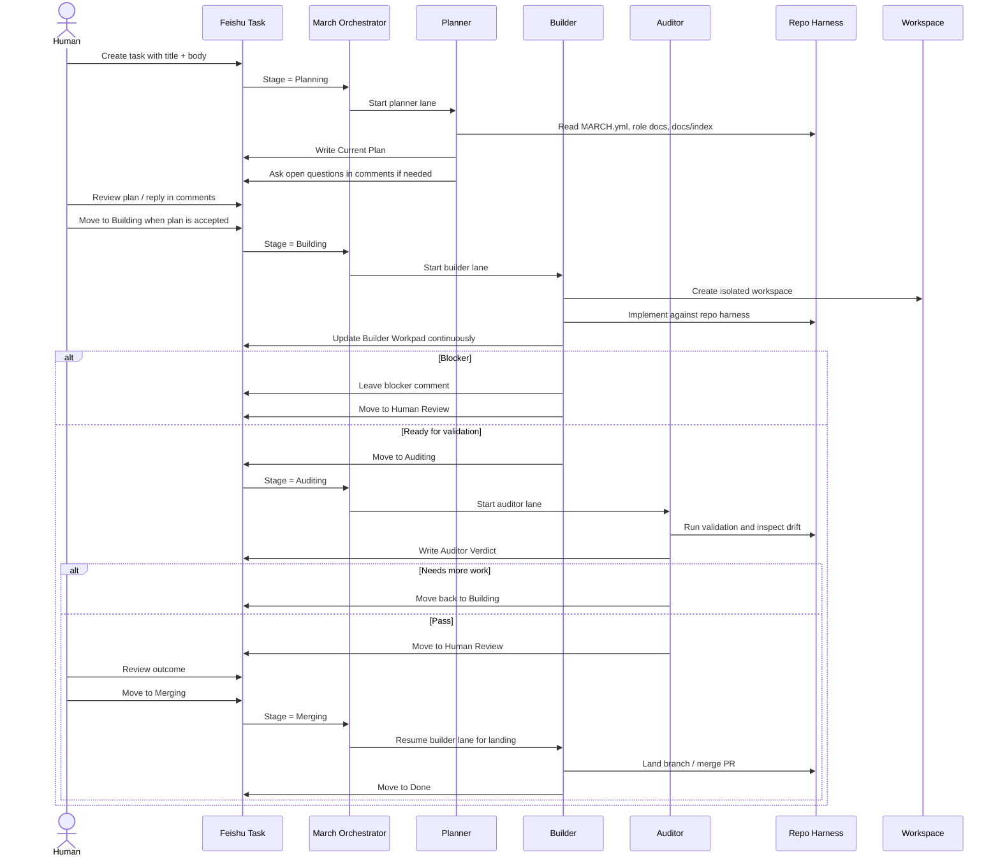

# March

[中文 README](./README.zh-CN.md)

Multi-lane coding orchestration for Feishu task workflows.

March is a Feishu-native orchestration system for planner, builder, and auditor
agent workflows.

It combines OpenAI's repo-as-harness harness engineering approach with the
long-running multi-agent collaboration practices popularized by Claude Code, and
lands those ideas on a single Feishu task surface.

March works best on repositories that already follow harness-engineering
discipline: the repo owns project truth, docs, and validation paths, while
March owns lifecycle orchestration, workspaces, and Feishu task state.

## What March Is

- A multi-lane coding workflow with planner, builder, and auditor roles
- A Feishu-native task system built around stages, comments, and custom fields
- A repo-as-harness execution model driven by repo docs, role docs, and isolated workspaces
- A human-in-the-loop delivery loop that keeps plan, execution, and review on the same task surface

## Why March

March is built around three opinions:

- orchestration should be long-running and lane-based, not a single chat loop
- the repo should own truth, while the runtime owns lifecycle
- Feishu comments, sections, and custom fields are a better collaboration surface for many China-based teams than a separate tracker stack

In practice that means:

- Planner reads the repo harness and writes one canonical implementation plan.
- Builder works in an isolated workspace and maintains one canonical builder workpad.
- Auditor validates the change, checks test coverage and harness drift, and decides whether more work is required.
- Humans stay on the same task surface through comments and stage changes.

## How It Works



March keeps the workflow surface in Feishu, while repo-local files remain the source of truth:

- `MARCH.yml`
- `PLANNER.md`
- `BUILDER.md`
- `AUDITOR.md`
- `docs/index.md`

Operational notes:

- March discovers work from Feishu tasks that are still `completed=false`.
- `Planning`, `Building`, and `Auditing` are the comment-driven stages. Comments in `Human Review` and `Merging` are not polled automatically.
- `Human Review` is a human gate. To resume automation, move the task back to an automation stage such as `Auditing`, `Building`, or `Merging`.
- `Merging` is builder-owned landing mode. When builder lands a task and moves it into a terminal stage such as `Done`, March also marks it completed so it drops out of later scans.

## Quickstart

1. Clone this repo.
2. Install `mise`, Elixir, and the other toolchain dependencies used by the `elixir/` app.
3. Run:

```bash
./scripts/setup
```

4. Install and authenticate `lark-cli`.
5. Bootstrap a Feishu tasklist:

```bash
./scripts/feishu-bootstrap --check-only
./scripts/feishu-bootstrap --create-tasklist "March Demo"
```

6. Prepare a target repo with:
   - `MARCH.yml`
   - `PLANNER.md`
   - `BUILDER.md`
   - `AUDITOR.md`
7. Paste the generated `tasklist_guid` into the target repo's `MARCH.yml`.
8. Check the target repo:

```bash
./scripts/doctor /path/to/target-repo
```

9. Start March against that repo:

```bash
./scripts/run.sh /path/to/target-repo
```

March is TUI-only. There is no web dashboard in this repo.

For a minimal starter profile, see [`examples/minimal`](./examples/minimal).

## Codex Setup

If you run March with Codex, make the bundled skills available to your Codex
installation. The canonical copies live in this repo under `.codex/skills/`:

- `feishu-task-ops`
- `pull`
- `push`
- `land`
- `debug`
- `commit`

Some Codex setups auto-load repo-local skills. If yours does not, copy or
symlink these skills into `$CODEX_HOME/skills` before using March.

For the exact install steps and the optional worktree bootstrap helper, see
[Codex Setup](./docs/codex-setup.md).

## Docs

- [Docs Index](./docs/index.md)
- [Codex Setup](./docs/codex-setup.md)
- [Feishu Setup](./docs/feishu-setup.md)
- [Harness Engineering Share](./docs/harness-engineering-share.md)

## Acknowledgements

March draws on ideas from OpenAI Symphony and the broader harness-engineering
approach to long-running agent systems.

- OpenAI, Harness Engineering:
  https://openai.com/index/harness-engineering/
- OpenAI, Unrolling the Codex agent loop:
  https://openai.com/index/unrolling-the-codex-agent-loop/
- Anthropic, Harness design for long-running application development:
  https://www.anthropic.com/engineering/harness-design-long-running-apps
- Anthropic, Managed agents:
  https://www.anthropic.com/engineering/managed-agents

## License

March is distributed under Apache-2.0. See [LICENSE](./LICENSE) and [NOTICE](./NOTICE).
