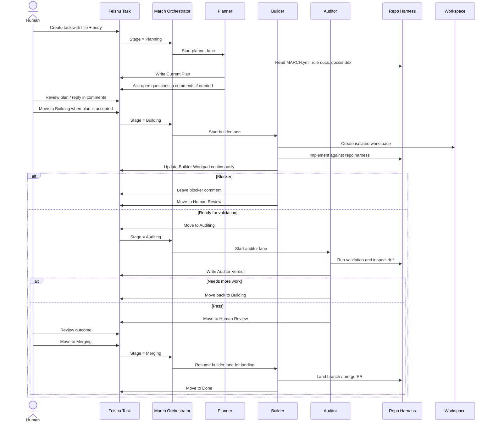

# March

[English README](./README.md)

面向飞书任务流的多 lane 编码编排系统。

March 是一个 Feishu-native 的 orchestrator，用来运行 planner、builder、auditor
三条 lane 的长时任务协作。

它把 OpenAI 提出的 repo-as-harness / harness engineering 思路，和 Claude Code
这类 long-running multi-agent 协作实践结合起来，最后落到同一张飞书 task
上完成 plan、执行、审计和 human-in-the-loop 交付。

March 最适合运行在已经做过 harness engineering 的仓库上：项目真相、文档和验证路径放在 repo 里，
March 负责生命周期编排、隔离 workspace，以及飞书任务状态流转。

## March 是什么

- 一个 planner / builder / auditor 多 lane 编码工作流
- 一个以飞书 tasks、comments、sections、custom fields 为中心的协作系统
- 一个 repo-as-harness 的执行模型：repo 管上下文和真相，runtime 管生命周期
- 一个 human-in-the-loop 交付回路：plan、执行、review 都落在同一张 task 上

## 为什么是 March

March 有三个核心观点：

- orchestration 应该是 long-running、lane-based 的，而不是单轮聊天循环
- repo 应该拥有 truth，runtime 只拥有 lifecycle
- 对很多中国团队来说，飞书 comments、sections、custom fields 比额外接一层 tracker 更自然

落到实践里，就是：

- Planner 读取 repo harness，写唯一的 implementation plan
- Builder 在隔离 workspace 里执行，并持续维护唯一的 builder workpad
- Auditor 跑验证、检查 harness drift，并给出明确 verdict
- 人类始终在同一张 task 上通过 comments 和 stage 变更参与流程

## 它怎么工作



March 把 workflow surface 放在飞书里，同时把 source of truth 保留在 repo 里：

- `MARCH.yml`
- `PLANNER.md`
- `BUILDER.md`
- `AUDITOR.md`
- `docs/index.md`

运行语义补充：

- March 从飞书里发现任务时，只扫描仍然是 `completed=false` 的 task。
- `Planning`、`Building`、`Auditing` 是 comment-driven stage；`Human Review` 和 `Merging` 里的评论不会被自动轮询。
- `Human Review` 是人工闸门。要恢复自动化处理，需要把 task 再移回 `Auditing`、`Building` 或 `Merging` 这样的自动化阶段。
- `Merging` 是 builder 接管的 landing 模式。builder 把 task 落到 `Done` 之类 terminal stage 后，March 会顺手补上 completed 标记，让它从后续扫描里消失。

## 快速开始

1. clone 本仓库。
2. 安装 `mise`、Elixir，以及 `elixir/` app 用到的工具链依赖。
3. 运行：

```bash
./scripts/setup
```

4. 安装并登录 `lark-cli`。
5. 初始化一个飞书 tasklist：

```bash
./scripts/feishu-bootstrap --check-only
./scripts/feishu-bootstrap --create-tasklist "March Demo"
```

6. 准备你的目标 repo：
   - `MARCH.yml`
   - `PLANNER.md`
   - `BUILDER.md`
   - `AUDITOR.md`
7. 把生成的 `tasklist_guid` 填回目标 repo 的 `MARCH.yml`。
8. 检查目标 repo：

```bash
./scripts/doctor /path/to/target-repo
```

9. 启动 March：

```bash
./scripts/run.sh /path/to/target-repo
```

March 目前只有 TUI，没有 web dashboard。

最小 profile 参考 [`examples/minimal`](./examples/minimal)。

## Codex 设置

如果你是和 Codex 一起使用 March，需要把 repo 内置的 skills 提供给 Codex。
规范版本放在 `.codex/skills/` 里：

- `feishu-task-ops`
- `pull`
- `push`
- `land`
- `debug`
- `commit`

有些 Codex 环境会自动加载 repo-local skills；如果你的不会，参考
[docs/codex-setup.md](./docs/codex-setup.md) 里的安装方式。

## 文档

- [Docs Index](./docs/index.md)
- [Codex Setup](./docs/codex-setup.md)
- [Feishu Setup](./docs/feishu-setup.md)
- [Harness Engineering Share](./docs/harness-engineering-share.md)

## Acknowledgements

March 受 OpenAI Symphony，以及更广义的 harness engineering / long-running agent
工程方法启发。

- OpenAI, Harness Engineering:
  https://openai.com/index/harness-engineering/
- OpenAI, Unrolling the Codex agent loop:
  https://openai.com/index/unrolling-the-codex-agent-loop/
- Anthropic, Harness design for long-running application development:
  https://www.anthropic.com/engineering/harness-design-long-running-apps
- Anthropic, Managed agents:
  https://www.anthropic.com/engineering/managed-agents

## License

March 使用 Apache-2.0。见 [LICENSE](./LICENSE) 和 [NOTICE](./NOTICE)。
