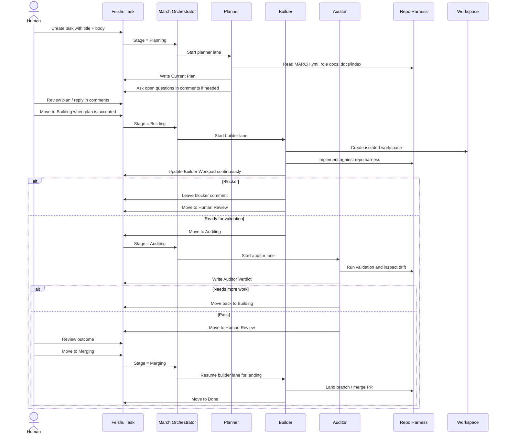

# March x Feishu x OpenAI Harness Engineering 技术讨论分享

作者：XavierX/Codex 协作整理  
日期：2026-04-12

## 1. 这份分享想回答什么问题

我们这段时间做的事情，不是简单地“给 agent 更多 prompt”，也不是简单地“把 OpenAI Symphony 的 tracker 换成 Feishu”。

更准确地说，我们是在把 `March` 这个编排层和目标 repo 的 harness 一起改造成一个更接近 OpenAI 官方 Harness Engineering 思路的系统。

核心问题有三个：

1. 如何让 March 负责生命周期编排，而让项目自己负责领域上下文、架构边界和验收标准？
2. 如何把“agent 能不能稳定完成任务”从 prompt 问题，变成仓库结构、工具、验证路径和协作面的工程问题？
3. 如何让 Feishu task -> planning -> building -> auditing -> human review -> merge 这条链路尽量变成可重复、可观察、可恢复的工程流程？

这份文档的重点，是把我们已经落地的实现说清楚，并对照 OpenAI 官方文章《[工程技术：在智能体优先的世界中利用 Codex](https://openai.com/zh-Hans-CN/index/harness-engineering/)》总结哪些地方已经对齐，哪些地方是我们基于中国团队协作环境做的特化。

## 2. OpenAI 官方文章里最值得抽出来的原则

结合官方文章，可以把 Harness Engineering 的关键思想概括成下面几条：

### 2.1 人类掌舵，智能体执行

人类不再主要负责逐行写代码，而是负责：

- 设定目标
- 设计环境
- 明确验收标准
- 构建反馈回路

换句话说，工程杠杆来自“把正确的系统搭起来”，而不是把 prompt 写得越来越长。

### 2.2 仓库是记录系统，不是聊天窗口的附属品

官方文章强调，agent 能可靠完成复杂任务的前提，是把知识放进仓库本身：

- repo map
- 架构文档
- role docs
- workflow config
- 测试与验证规则
- 开发脚本

如果知识只存在于 IM、文档平台、临时聊天或人的脑子里，agent 在运行时就看不到它。

### 2.3 给 agent 地图，不要给 agent 一本一千页手册

官方文章明确反对“大而全 AGENTS.md”。

更有效的方式是分层暴露上下文：

- 一个小而稳定的入口
- 明确的阅读顺序
- 逐步展开的上下文
- 只在需要时加载子系统文档和外部参考

这本质上是在做上下文的“渐进式披露”。

### 2.4 目标不是“让代码看起来高级”，而是“让系统对 agent 可读”

官方文章反复强调 agent readability：

- 边界要清晰
- 目录和依赖方向要稳定
- 工具要可调用
- 日志、测试、状态和验证结果要能被 agent 直接观察

这意味着项目设计要服务于智能体的推理能力，而不只是服务于人的审美。

### 2.5 验收不能只靠语言，必须靠环境

真正的 Harness Engineering 不是“请你在提交前自测一下”，而是：

- 给 agent 可运行的脚本
- 给 agent 可重现的验证路径
- 给 agent 可读的结果产物
- 给 agent 明确的 merge boundary

只有这样，agent 才能靠执行而不是靠想象完成任务。

### 2.6 高吞吐会改写传统工程习惯

在 agent 吞吐量高于人工注意力的情况下：

- task 生命周期要短
- review 和修复要尽量程序化
- 反馈循环要快
- 错误要能廉价修复

这也是为什么 workflow、workspace、validation、handoff、merge boundary 都要尽量工程化。

## 3. 我们的设计原则：让 March 做 orchestration，让项目做 truth

我们最后落地的方向可以概括成一句话：

> March 负责“调度和生命周期”，目标项目负责“上下文、约束、验收和领域真相”。

这和 OpenAI 官方思路是对齐的。

如果让 March 承担太多项目细节，会有三个问题：

- 项目知识漂移到 orchestration 层，难以和代码一起演化
- workflow 和 repo 实际行为脱节
- agent 在不同项目之间复用时会把项目私货带来带去

所以我们采用的是 project-owned harness 模式：

- `march` 负责 orchestrator、workspace 生命周期、Feishu task 接入、agent runtime 和 TUI 可观察性
- 目标 repo 自己维护 `MARCH.yml`、`PLANNER.md`、`BUILDER.md`、`AUDITOR.md`、`docs/index.md`、knowledgebase 和验证规则

这让项目本身成为 system of record，而 March 只是执行外骨骼。

## 4. 当前落地实现

### 4.1 项目自有的 repo map 和上下文入口

在 March 的 repo contract 里，第一层入口被收敛成小而稳定的地图：

- `MARCH.yml`
- `PLANNER.md`
- `BUILDER.md`
- `AUDITOR.md`
- `docs/index.md`

这个设计对应了官方文章里的“给地图，不要给一千页说明书”。

我们做的不是把所有背景一次性塞给 agent，而是：

1. 先用 `MARCH.yml` 说明运行时 contract 和 stage 映射
2. 再用 role docs 说明 planner / builder / auditor 各自的职责、阅读顺序和输出要求
3. 再通过 `docs/index.md` 引导 agent 按需阅读 repo knowledgebase
4. 必要时再去看外部参考，例如 OpenClaw 的相关实现

### 4.2 Feishu-native workflow：让协作面和执行面收敛到同一张 task

March 不是 generic tracker marketplace，而是一个 Feishu-native workflow system。

我们把一张 task 内的信息面分成三层：

人类拥有：

- title
- body / description
- comments

March 维护但人类可见：

- `Current Plan`
- `Builder Workpad`
- `Auditor Verdict`
- `PR`
- `Task Kind`
- `Task Key`

内部 bookkeeping：

- `task.extra`

这里最关键的设计是：

- 评论承担讨论面
- custom fields 承担 canonical state surface
- `task.extra` 只存内部 hook 状态，不存主要的人类协作真相

### 4.3 用 task section 承载大阶段，用内部 hook 承载细状态

Feishu tasklist 本身就适合承载大阶段：

- Backlog
- Planning
- Building
- Auditing
- Human Review
- Merging
- Done
- Canceled

而更细的 builder pickup / planner review / auditor rework 之类的内部状态，则收在内部 hook 里，不污染看板列语义。

这让看板对人类保持可读，同时又给 runtime 保留足够的状态表达能力。

### 4.4 单 plan + 单 workpad 的协作模式

我们把 task 过程中的主要状态管理收成稳定的单一 surface：

- `Current Plan` 永远只有一份
- `Builder Workpad` 永远只有一份
- `Auditor Verdict` 永远只有一份

这样做的效果是：

- 人类永远知道应该去哪里看最新计划
- builder workpad 不会分叉
- auditor 结论不会散在聊天记录里
- retry 或重启以后，新的 agent 也能从稳定 surface 继续接力

### 4.5 一个 task 的完整生命周期

这是我们最核心的流程图：

这张图对应的不是“聊天流程”，而是 task lifecycle。

它的重点不是谁说了多少话，而是：

- 谁拥有哪个阶段
- 哪些 artifact 会被稳定更新
- 哪些反馈回路是自动的
- 哪些地方必须回到 human review

### 4.6 Workspace 和 canonical branch：把执行边界收清楚

March 不是直接在目标 repo 根目录里编码，而是为 builder / auditor 维护隔离 workspace。

这样做的好处是：

- 多任务并行时不互相污染
- retry 和恢复有清晰边界
- 任务级 workspace 生命周期可管理
- merge 后可以同步回 canonical branch

这也是为什么我们会把 canonical branch、workspace bootstrap、repo sync 都明确写进 repo contract，而不是隐式靠操作习惯。

### 4.7 TUI-only：只保留真正有价值的运行面

我们最后把 web dashboard 删掉，只保留 TUI。

原因很现实：

- 这类 orchestrator 的关键不是“再做一个 Web 管理后台”
- 而是把当前活跃任务、lane/stage、retry、repo sync、workspace 和 agent run 状态收清楚

TUI 已经足够承载这些信息，而继续保留 web 只会增加维护面，却不增加核心价值。

### 4.8 Feishu bootstrap：把“手工点表”收成脚本

在 tasklist 初始化这一步，March 额外做了一层产品化收口：

- 检查 `lark-cli` 版本
- 检查本地 auth 是否有效
- 检查 task 相关 scopes 是否齐全
- 自动创建或补齐 tasklist 的 sections
- 自动创建或补齐 March 需要的 custom fields

也就是说，用户不需要手工一项一项点出：

- `Planning`
- `Building`
- `Auditing`
- `Human Review`
- `Merging`
- `Done`
- `Canceled`

以及：

- `Current Plan`
- `Builder Workpad`
- `Auditor Verdict`
- `PR`
- `Task Kind`
- `Task Key`

这一步让 March 更接近一个可以直接跑起来的系统，而不只是概念说明或最小样例。

## 5. 这套实现如何映射到 OpenAI 最佳实践

### 5.1 “仓库是记录系统”

我们已经做到了很大一部分：

- 项目知识主要在 repo 内
- role docs 是 repo 内契约
- validation path 在 repo 内
- canonical branch 和 workspace 规则在 repo 内

这是对齐的。

### 5.2 “给地图，不要给手册”

我们现在的层次是合理的：

- `MARCH.yml` 作为运行入口
- role docs 作为 agent 分工入口
- `docs/index.md` 作为 repo knowledgebase 的总索引
- 子系统文档按需展开

这比塞一个巨大单文件更符合 agent 的阅读方式。

### 5.3 “验收要靠环境，不要只靠语言”

March 的一个核心方向，就是把验收从口头承诺变成可运行路径：

- builder 不是“宣称做完了”，而是要更新 workpad
- auditor 不是“简单看一眼”，而是要跑验证并写 verdict
- human review 不是被聊天记录驱动，而是被稳定 artifact 和 task stage 驱动

这是非常典型的 harness engineering 思路。

## 6. March 相比原始 Symphony，多做了什么

如果只把 March 理解成 “Symphony but on Feishu”，其实低估了它。

更准确的说法是：March 在 Symphony-inspired orchestration 的基础上，又补上了更完整的 workflow surface 和 harness surface。

具体体现在：

- 不再依赖 Linear 语义，而是直接落到 Feishu task / comments / sections / custom fields
- 把 planner / builder / auditor 的职责拆得更明确
- 把 repo-as-harness 原则真正落到项目自己的 role docs 和 docs index 上
- 把 task lifecycle 收成一个对中国团队更自然的协作面
- 只保留 TUI，减少运行面复杂度
- 用 bootstrap 脚本降低首次搭建成本

## 7. 总结

如果要把 March 的方法压缩成一句话，我会这样说：

> March 不是一个“接了飞书 API 的 agent”，而是一套把 orchestration、repo harness 和 human workflow 收成统一工程系统的实现。

它从 OpenAI Symphony 学的是 orchestration 思路，从 Harness Engineering 学的是 repo operating model，再把这些落到了更适合中国团队协作的 Feishu task surface 上。

最后落到工程层面，就是：

- 用 Feishu 承载 workflow surface
- 用 repo 承载 source of truth
- 用 March 承载 long-running orchestration
