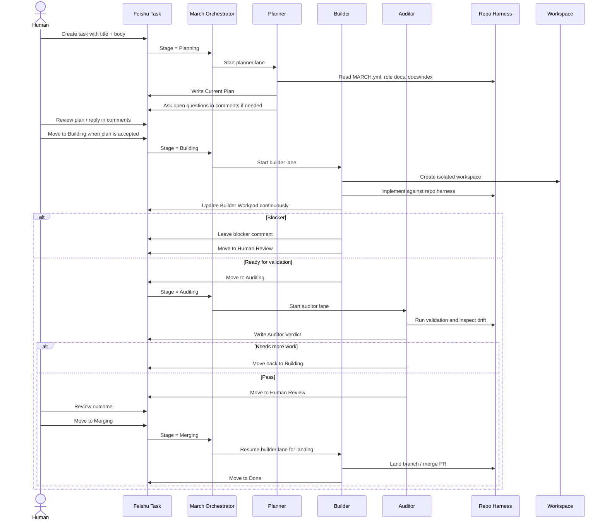

# Docs Index

Start here if you want to understand or run March.

## Core Docs

- [Codex Setup](./codex-setup.md): how to install the bundled Codex skills March expects
- [Feishu Setup](./feishu-setup.md): expected Feishu tasklist structure and fields
- [Harness Engineering Share](./harness-engineering-share.md): the design story behind March, Feishu-native workflow, and repo-as-harness thinking

## Example Profiles

- [`examples/minimal`](../examples/minimal): the smallest profile shape March expects

## Operator Surface

- March is TUI-only today.
- Feishu Tasks are the single external workflow surface.
- Repo-local docs and role files are the harness.

## Mental Model

March has three layers:

1. Runtime orchestration in `elixir/`
2. Feishu task state as the collaboration surface
3. Repo-local workflow files and docs as the harness

The runtime keeps clean internal boundaries, and March is built around Feishu Tasks today.

## Lifecycle

March runs a multi-lane coding workflow on top of Feishu tasks.

Lanes:

- Planner: turns the task body and repo context into a concrete implementation plan
- Builder: executes against the approved plan and maintains the live builder workpad
- Auditor: validates the implementation, checks tests, and decides whether more work is needed

Expected task surface:

- Human-authored: title, description/body, comments
- March-managed: current plan, builder workpad, auditor verdict

Typical lifecycle:

1. Human creates a task and writes the body.
2. Planner reads the repo harness, writes the initial plan, and asks open questions in comments if needed.
3. Human reviews the plan in the same task.
4. Builder executes the work in an isolated workspace and updates the workpad in place.
5. Auditor validates the result and either sends it back for more work or clears it for human review.
6. Human reviews and merges according to repo policy.

Design principles:

- keep one canonical plan surface
- keep one canonical builder workpad surface
- keep human feedback in comments
- use repo docs and role docs as source of truth
- keep planner / builder / auditor responsibilities distinct
